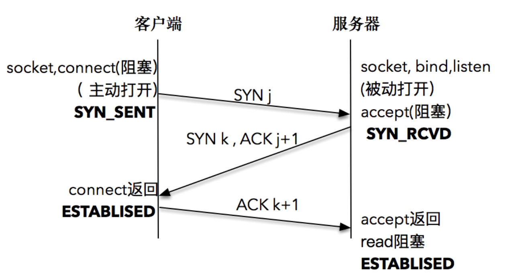

## 套接字类型与协议设置

### 套接字协议及其数据传输特性

- 协议：完成数据交换制定的约定。

</br>

#### 创建套接字：`int socket(int domain, int type, int protocol);`

- 参数
  - `domain` ：套接字中使用的协议族信息，决定第三个参数 `protocol`
  - `type` ：套接字数据传输的类型信息
  - `protocol` ： 计算机间通信中使用的协议信息(废弃)

</br>

#### domain参数：协议族

| 名称      | 协议族               |
| --------- | -------------------- |
| PF_INET   | IPv4互联网协议族     |
| PF_INET6  | IPv6互联网协议族     |
| PF_LOCAL  | 本地通信的Unix协议族 |
| PF_PACKET | 底层套接字的协议族   |
| PF_IPX    | IPX Novell协议族     |

</br>

#### type参数：套接字类型

##### 面向连接的套接字（SOCK_STREAM)

- 面向连接的套接字特点
  - 传输过程数据不会丢失
  - 按序传输数据
  - 传输数据不存在数据边界
- 收发数据的套接字内部有缓冲，即字节数组
- 套接字连接必须一一对应

> 可靠的、按序传递、基于字节的面向连接的数据传输方式的套接字。

</br>

##### 面向消息的套接字（SOCK_DGRAM)

- 面向消息的套接字特点
  - 快速传输
  - 数据可能丢失/损毁
  - 传输数据有数据边界
  - 限制每次传输的数据大小

> 不可靠的、不按序传递、以数据的高速传输为目的的套接字。

### 协议选择

- 面向连接的套接字： `IPPROTO_TCP`
- 面向消息的套接字： `IPPRORO_UDP`

</br>

### 服务端连接过程

#### 1. socket : 指定协议信息

- 创建一个可用的 `socket` ，指定协议族（IPv4 / IPv6) 和 传输类型（字节流/ 数据报，即TCP / UDP）

```C
int socket(int domain, int type, int protocol);
```


#### 2. bind : 绑定地址信息

- `bind` 将套接字与套接字地址绑定

```C
bind(fd, sockaddr* addr, socklen_t len);
```

</br>

```C
struct sockaddr_in name;
bind(sock, (struct sockaddr *) &name, sizeof(name));
```


- 对于使用者，将IPv4、IPv6、本地套接字格式转化为通用套接字格式
- 对于实现者，根据地址结构的前两个字节判读出哪种地址


设置通配地址

```C
struct sockaddr_in name;
name.sin_addr.s_addr = htonl(INADDR_ANY);
```

设置通配端口：将端口设置为0，则表示将端口选择权交给操作系统内核，操作系统根据一定算法选择一个空闲的端口，完成绑定。

</br>

#### listen : 监听状态

`listen` 使初始化的套接字由主动状态变为被动状态，使得套接字用来等待用户请求。

```C
int listen(int socketfd, int backlog);
```

- Socketed: 套接字文件描述符
- backlog：已完成（ESTABLISHED）且未accept的队列大小，决定可以接受的并发数目。

</br>

#### Accept: 建立连接

客户端连接请求到达，服务器应答成功，连接建立。操作系统通知应用程序，使得其感知连接建立。`accept` 看作操作系统与应用程序之间的桥梁。

```C
int accept(int listensockfd, struct sockaddr* cliaddr, socklen_t *addrlen);
```

- listensockfd : listen 套接字，**输入参数**
- cliaddr ： 通过指针方式获得的客户端地址， **返回参数**
- addrlen ： 地址大小

</br>

### 客户端发起连接过程

#### connect ： 发起连接

客户端与服务端建立连接通过 `connect` 

```C
int connect(int sockfd, const struct sockaddr* servaddr, socklen_t addrlen);
```

- Sockfd : 连接套接字，由socket函数创建
- servaddr ：套接字地址结构的指针
- addrlen：结构大小

</br>

> TCP 套接字，在connect的三次握手可能出错的三种情况：
>
> 1. TIMEOUT错误：客户端的SYN包无响应
>
> 2. CONNECTION REFUSED错误：客户端收到RST回答，返回错误。
>
>    产生RST的三个条件：
>
>    - 目的地为某端口SYN到达，但没有正在监听的服务器
>    - TCP取消已有连接
>    - TCP接受到一个不存在的连接的节点
>
> 3. DESTINATION UNREACHABLE错误：目的不可达错误，路由不通

</br>

### TCP三次握手

#### TCP 三次握手过程



1. 客户端的协议栈向服务器端发送了 SYN 包，并告诉服务器端当前发送序列号 j，客户端进入 SYNC_SENT 状态；
2. 服务器端的协议栈收到这个包之后，和客户端进行 ACK 应答，应答的值为 j+1，表示对 SYN 包 j 的确认，同时服务器也发送一个 SYN 包，告诉客户端当前我的发送序列号为 k，服务器端进入 SYNC_RCVD 状态；
3. 客户端协议栈收到 ACK 之后，使得应用程序从 connect 调用返回，表示客户端到服务器端的单向连接建立成功，客户端的状态为 ESTABLISHED，同时客户端协议栈也会对服务器端的 SYN 包进行应答，应答数据为 k+1；
4. 应答包到达服务器端后，服务器端协议栈使得 accept 阻塞调用返回，这个时候服务器端到客户端的单向连接也建立成功，服务器端也进入 ESTABLISHED 状态。

</br>

#### TCP为什么需要三次握手

回答1：服务器端与客户端需要确认双方的收发服务是否正常，第一次客户端发送SYN j，服务器端接受并发送SYN k，ACK j+1（**确认客户端发送服务**），客户端接受SYN k（**确认服务端发送 接受服务**），发送ACK k+1,服务端接受到（**确认客户端接受服务**）

回答2: 信道不可信，三次通信是理论最小值，三次握手为了满足在不可靠信道上进行可靠地传输。


