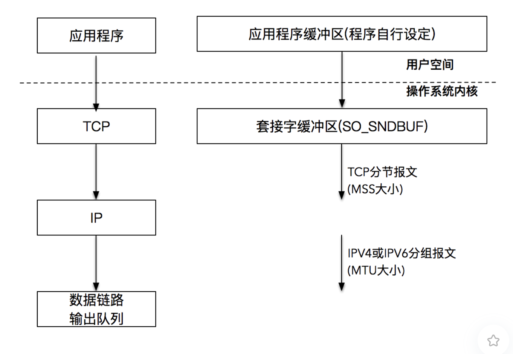

### 实现基于TCP的服务端/客户端

#### TCP服务端的默认函数调用顺序

- socket()：创建套接字
- bind()：分配套接字地址
- listen()：等待连接请求状态
  - 进入等待连接状态
- accept()：允许连接
  - 受理客户端连接请求
- read() / write()：数据交换
- close：断开连接

</br>

#### TCP客户端的默认函数调用顺序

- socket()：创建套接字
- conncet()：请求连接
- read() / write()：交换数据
- close()：断开连接

> 客户端的套接字地址在调用 `connect` 时，操作系统使用计算机的IP，端口号随机分配地址。

</br>

### 使用套接字进行读写

#### 发送数据

```
ssize_t write(int socketfd, const void *buffer, size_t size);
ssize_t send(int socketfd, const void *buffer, size_t, int flags);
ssize_t sendmsg(int sockfd, const struct msghdr *msg, int flags);
```

- write() ：文件写函数
- send()：指定 `flag` ，发送带外数据（基于TCP协议的紧急数据）
- sendmsg()：指定多重缓冲区传输数据

</br>

普通文件的 `write()` 与 `套接字描述符` 的`write` 区别

- 普通文件描述符，调用 write() 函数，写入字节流与输入参数 `size` 大小相同
- 套接字文件描述符，调用 write() 函数时，代表双向连接，调用 write() 写入字节数可能比请求的数量少。

##### 发送缓冲区

应用程序发送数据的过程：调用 `write()` ，实际上将应用程序的数据拷贝至操作系统内核的**发送缓冲区** 。

- 当操作系统缓冲区足够大时，write() 调用退出，返回写入字节数是应用程序大小哦
- 当操作系统缓冲区不足以保存应用程序所有数据，应用程序**阻塞** ，操作系统通过TCP/IP将数据发送出去，等到缓冲区有空闲时，应用程序继续将数据写入缓冲区。当所有数据都放置缓冲区时，write() 阻塞调用返回，此时应用程序所有数据并未全部发送出去（缓冲区还有部分数据）。



</br>

#### 读取数据

#### read()

```C
ssize_t read(int socketfd, void* buffer, size_t size);
```

- `read()` 从套接字中读取size个字节，将结果存入 `buffer` 中
- 返回值为实际读取的字节数
  - 0：表示EOF，网络对端发送FIN包，中断连接
  - -1：出错

```C

/* 从socketfd描述字中读取"size"个字节. */
size_t readn(int fd, void *buffer, size_t size) {
    char *buffer_pointer = buffer;
    int length = size;

    while (length > 0) {
        int result = read(fd, buffer_pointer, length);

        if (result < 0) {
            if (errno == EINTR)
                continue;     /* 考虑非阻塞的情况，这里需要再次调用read */
            else
                return (-1);
        } else if (result == 0)
            break;                /* EOF(End of File)表示套接字关闭 */

        length -= result;
        buffer_pointer += result;
    }
    return (size - length);        /* 返回的是实际读取的字节数*/
}
```

</br>

- 对于send，返回成功表示数据写入缓冲区成功，并不表示对端成功接受
- 对于read，需要勋韩读取数据，并且考虑EOF等异常条件


